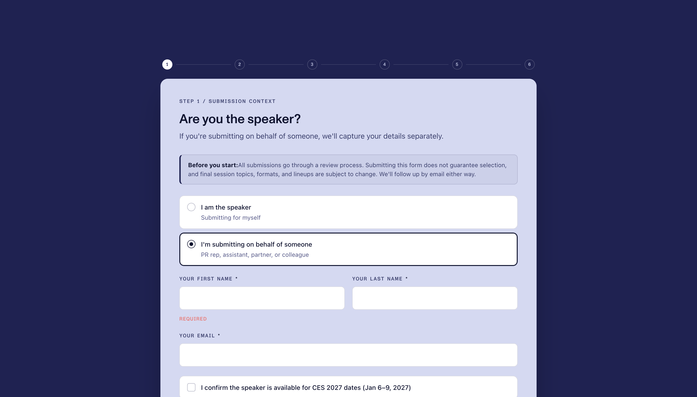
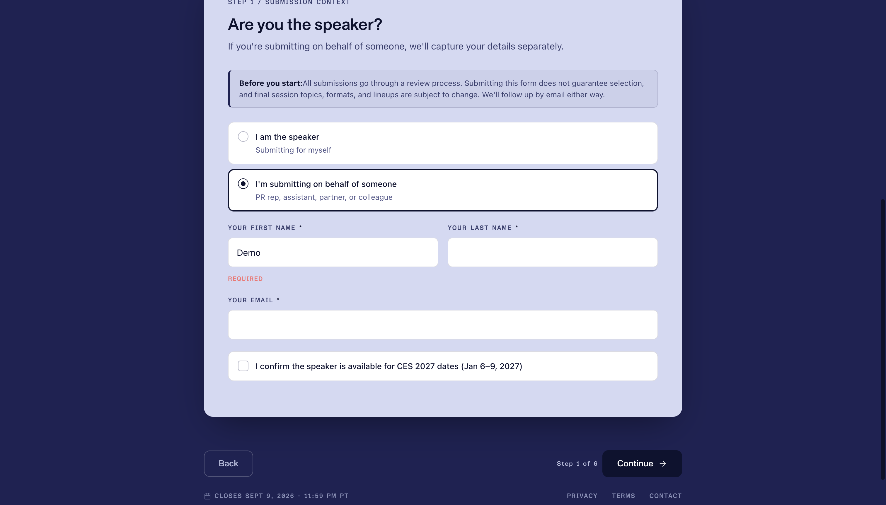
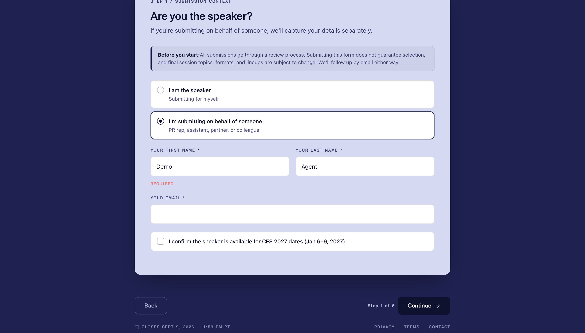
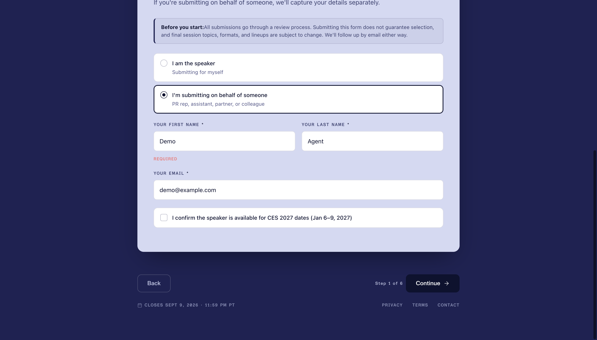
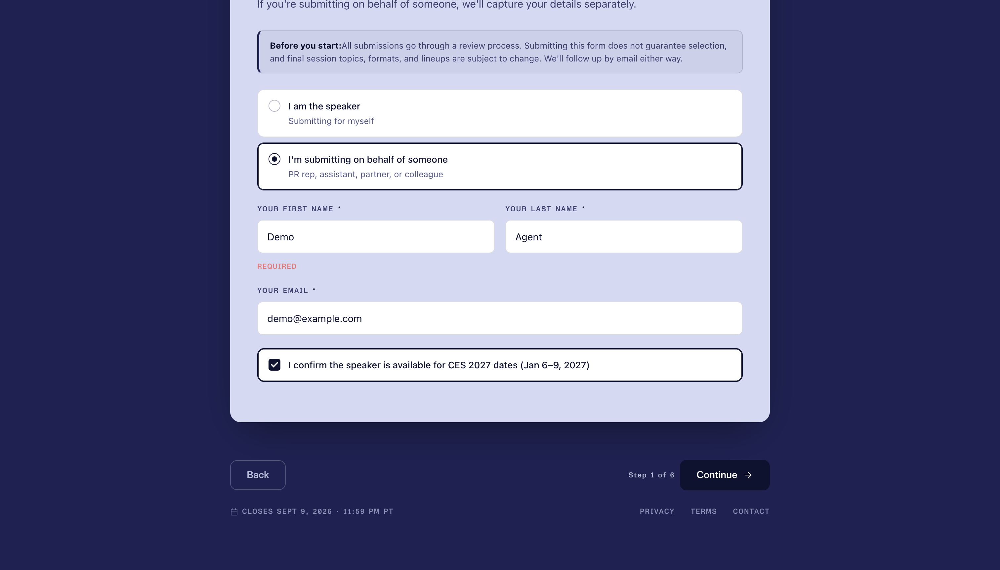

# Agent demo log

Live run against the active Chrome tab. Dummy values only. **Continue was not clicked.**

- Tab: `1807951524`
- Page: [Call for Speakers · CES 2027](https://platforms.ces.tech/forms/cfs_2027)
- Filled as: Demo Agent / `demo@example.com`

Each step: the command, the snapshot listing, then a viewport screenshot (`chrome.tabs.captureVisibleTab` — not the full page).

---

## 0. Starting state

The second radio was already selected from the previous click (`I'm submitting on behalf of someone`). Name and email were empty.

```bash
browser-session-ctl snapshot
browser-session-ctl screenshot doc/demo-trace/00-start.png
```

Snapshot:

```
Call for Speakers · CES 2027
https://platforms.ces.tech/forms/cfs_2027

[e1] heading "Are you the speaker?"
[e2] radio "I am the speaker Submitting for myself"
[e3] radio "I'm submitting on behalf of someone PR rep, assistant, partner, or colleague"
[e4] textbox "YOUR FIRST NAME"
[e5] textbox "YOUR LAST NAME"
[e6] textbox "YOUR EMAIL"
[e7] checkbox "I confirm the speaker is available for CES 2027 dates (Jan 6–9, 2027)"
```



---

## 1. Type first name

```bash
browser-session-ctl type e4 Demo
```

Result: `{ "ref": "e4", "value": "Demo" }`

```bash
browser-session-ctl snapshot
browser-session-ctl screenshot doc/demo-trace/01-first-name.png
```

Snapshot:

```
Call for Speakers · CES 2027
https://platforms.ces.tech/forms/cfs_2027

[e1] heading "Are you the speaker?"
[e2] radio "I am the speaker Submitting for myself"
[e3] radio "I'm submitting on behalf of someone PR rep, assistant, partner, or colleague"
[e4] textbox "YOUR FIRST NAME" value="Demo"
[e5] textbox "YOUR LAST NAME"
[e6] textbox "YOUR EMAIL"
[e7] checkbox "I confirm the speaker is available for CES 2027 dates (Jan 6–9, 2027)"
[e8] button "Back"
[e9] button "Continue"
[e10] link "Privacy policy (opens in new tab)"
[e11] link "Terms of use (opens in new tab)"
[e12] link "Email the CES conferences team"
```

`e4` now has `value="Demo"`. Back / Continue became visible.



---

## 2. Type last name

```bash
browser-session-ctl type e5 Agent
```

Result: `{ "ref": "e5", "value": "Agent" }`

```bash
browser-session-ctl snapshot
browser-session-ctl screenshot doc/demo-trace/02-last-name.png
```

Snapshot:

```
Call for Speakers · CES 2027
https://platforms.ces.tech/forms/cfs_2027

[e1] heading "Are you the speaker?"
[e2] radio "I am the speaker Submitting for myself"
[e3] radio "I'm submitting on behalf of someone PR rep, assistant, partner, or colleague"
[e4] textbox "YOUR FIRST NAME" value="Demo"
[e5] textbox "YOUR LAST NAME" value="Agent"
[e6] textbox "YOUR EMAIL"
[e7] checkbox "I confirm the speaker is available for CES 2027 dates (Jan 6–9, 2027)"
[e8] button "Back"
[e9] button "Continue"
[e10] link "Privacy policy (opens in new tab)"
[e11] link "Terms of use (opens in new tab)"
[e12] link "Email the CES conferences team"
```



---

## 3. Type email

```bash
browser-session-ctl type e6 demo@example.com
```

Result: `{ "ref": "e6", "value": "demo@example.com" }`

```bash
browser-session-ctl snapshot
browser-session-ctl screenshot doc/demo-trace/03-email.png
```

Snapshot (refs shifted — the heading left the visible set):

```
Call for Speakers · CES 2027
https://platforms.ces.tech/forms/cfs_2027

[e1] radio "I am the speaker Submitting for myself"
[e2] radio "I'm submitting on behalf of someone PR rep, assistant, partner, or colleague"
[e3] textbox "YOUR FIRST NAME" value="Demo"
[e4] textbox "YOUR LAST NAME" value="Agent"
[e5] textbox "YOUR EMAIL" value="demo@example.com"
[e6] checkbox "I confirm the speaker is available for CES 2027 dates (Jan 6–9, 2027)"
[e7] button "Back"
[e8] button "Continue"
[e9] link "Privacy policy (opens in new tab)"
[e10] link "Terms of use (opens in new tab)"
[e11] link "Email the CES conferences team"
```

The checkbox is now `e6`, not `e7`. Snapshot again before the next click.



---

## 4. Check the dates box

```bash
browser-session-ctl click e6
```

Result: `{ "ref": "e6", "name": "I confirm the speaker is available for CES 2027 dates (Jan 6–9, 2027)" }`

```bash
browser-session-ctl snapshot
browser-session-ctl screenshot doc/demo-trace/04-checkbox.png
```

Snapshot (no `checked` flag — this control is `role="checkbox"`, not a native `<input>`):

```
Call for Speakers · CES 2027
https://platforms.ces.tech/forms/cfs_2027

[e1] radio "I am the speaker Submitting for myself"
[e2] radio "I'm submitting on behalf of someone PR rep, assistant, partner, or colleague"
[e3] textbox "YOUR FIRST NAME" value="Demo"
[e4] textbox "YOUR LAST NAME" value="Agent"
[e5] textbox "YOUR EMAIL" value="demo@example.com"
[e6] checkbox "I confirm the speaker is available for CES 2027 dates (Jan 6–9, 2027)"
[e7] button "Back"
[e8] button "Continue"
[e9] link "Privacy policy (opens in new tab)"
[e10] link "Terms of use (opens in new tab)"
[e11] link "Email the CES conferences team"
```

The screenshot shows the box checked and outlined. That is the verification snapshot cannot give yet.



---

## 5. Scroll down

```bash
browser-session-ctl scroll down
```

Result: `{ "y": 676.5 }`

```bash
browser-session-ctl snapshot
browser-session-ctl screenshot doc/demo-trace/05-scrolled.png
```

Snapshot (same controls; the form already fit the viewport, so the listing did not change):

```
Call for Speakers · CES 2027
https://platforms.ces.tech/forms/cfs_2027

[e1] radio "I am the speaker Submitting for myself"
[e2] radio "I'm submitting on behalf of someone PR rep, assistant, partner, or colleague"
[e3] textbox "YOUR FIRST NAME" value="Demo"
[e4] textbox "YOUR LAST NAME" value="Agent"
[e5] textbox "YOUR EMAIL" value="demo@example.com"
[e6] checkbox "I confirm the speaker is available for CES 2027 dates (Jan 6–9, 2027)"
[e7] button "Back"
[e8] button "Continue"
[e9] link "Privacy policy (opens in new tab)"
[e10] link "Terms of use (opens in new tab)"
[e11] link "Email the CES conferences team"
```


Stopped here. The form is filled. Continue was left alone.
